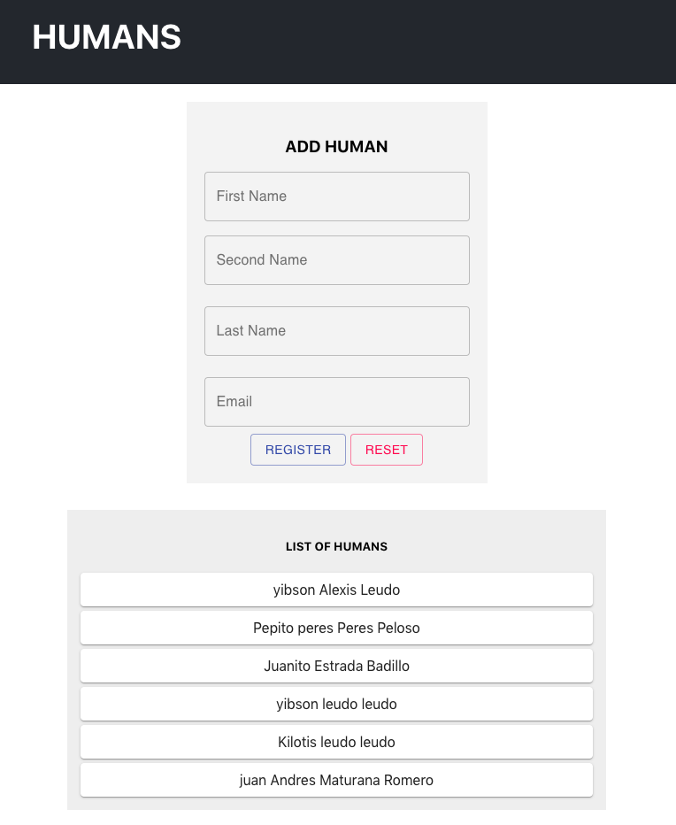

# React-Form + Formik + Yup + MaterialUI +GraphQL

This is a quick example of how to use form validations in React, using Formik and Yup as validations schema.

We will use Material-UI to give it a touch of style next to the formik-material-ui package.

This example allows us to integrate Material-UI to our forms already built in Formik without affecting their operation.

Let's use GraphQL with Apollo Client to save our information

### Note: 
To save the information of this example I make use of a tutorial created previously by me [here](https://github.com/yibsonalexis/sls-grapgQL-lambdaFunction-dynamoDB)

## Formik Form Validation - customerForm.js
The CustomerForm component contains a registration form built with the `<Formik />` component. <br>
The initial values of each field are defined in the `initialValues` property. <br>
All validation rules and their respective error messages are set in the `validationSchema` property, which for this constraint we are using Yup to define our validation scheme. The `onSubmit` property receives the values of our field in addition to a `resetForm` property that allows us to reset the Form

More information 
- [Formik](https://jaredpalmer.com/formik/docs/tutorial)
- [Yup](https://github.com/jquense/yup)
- [formik-material-ui](https://github.com/stackworx/formik-material-ui)
- [material-ui](https://material-ui.com/demos/text-fields/)
- [Apollo GraphQL](https://www.apollographql.com/docs/react/essentials/get-started/)


### Import our Packages
```
import React from "react";
import gql from "graphql-tag";
import Button from "@material-ui/core/Button";
import { Formik, Field, Form } from "formik";
import { TextField } from "formik-material-ui";
import * as Yup from "yup";
import { useMutation } from "@apollo/react-hooks";
import { GET_CUSTOMERS } from "./customers";
```
### We define the model of our mutation 

```
const ADD_CUSTOMER = gql`
  mutation CreateCustomer(
    $FullName: String
    $FirstName: String
    $SecondName: String
    $LastName: String
  ) {
    CreateCustomer(
      FullName: $FullName
      FirstName: $FirstName
      SecondName: $SecondName
      LastName: $LastName
    )
  }
`;
```
### Define our copoment
```
export function CustomersForm() {
  const [addCustomer, { data }] = useMutation(ADD_CUSTOMER, {
    refetchQueries: [{ query: GET_CUSTOMERS }]
  });
  console.log(data);

  return (
    <div id="customerForm">
      <h3>ADD HUMAN</h3>
      <Formik
        initialValues={{
          FirstName: "",
          SecondName: "",
          LastName: "",
          Email: ""
        }}
        validationSchema={Yup.object().shape({
          FirstName: Yup.string().required("First Name is required"),
          SecondName: Yup.string().required("Second Name is required"),
          LastName: Yup.string().required("Last Name is required"),
          Email: Yup.string()
            .email("Email is invalidd")
            .required("Email is required")
        })}
        onSubmit={(fields, { resetForm }) => {
          addCustomer({
            variables: {
              ...fields,
              FullName: `${fields.FirstName}  ${fields.SecondName}  ${fields.LastName}`
            }
          });
          resetForm();
        }}
        render={({ errors, status, touched }) => (
          <Form>
            <Field
              label="First Name"
              name="FirstName"
              type="text"
              component={TextField}
              margin="none"
              variant="outlined"
              fullWidth
            />
            <Field
              label="Second Name"
              name="SecondName"
              type="text"
              component={TextField}
              margin="normal"
              variant="outlined"
              fullWidth
            />
            <Field
              label="Last Name"
              name="LastName"
              type="text"
              component={TextField}
              margin="normal"
              variant="outlined"
              fullWidth
            />
            <Field
              label="Email"
              name="Email"
              type="text"
              component={TextField}
              margin="normal"
              variant="outlined"
              fullWidth
            />
            <Button type="submit" variant="outlined" color="primary">
              Register
            </Button>{" "}
            <Button type="reset" variant="outlined" color="secondary">
              Reset
            </Button>
          </Form>
        )}
      ></Formik>
    </div>
  );
}

```

## List of Humans - customers.js

### Import our Packages
```
import React from "react";
import gql from "graphql-tag";
import { useQuery } from "@apollo/react-hooks";
import { Card } from "@material-ui/core";
```

### We define the model of our Query 
```
export const GET_CUSTOMERS = gql`
  {
    Customers {
      ID
      FullName
      SecondName
      LastName
      FirstName
    }
  }
`;
```

### Define our copoment
```
export function Customers() {
  const { loading, error, data } = useQuery(GET_CUSTOMERS, {
    // pollInterval: 5000, //Call Function eache 5 seconds
  });

  if (loading) return <p>Loading...</p>;
  if (error) return <p style={{ color: "red" }}> Error! ${error.message}`</p>;
  return (
    <div id="viewCustomers">
      <h5>LIST OF HUMANS</h5>
      {data.Customers.map((p, i) => (
        <Card
          key={i}
          style={{ padding: "10px", margin: "5px" }}
        >{`${p.FirstName}  ${p.SecondName} ${p.LastName}`}</Card>
      ))}
    </div>
  );
}

```
